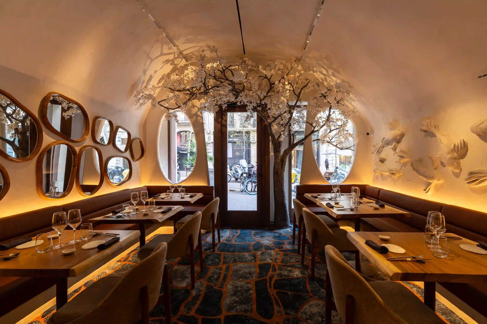

# Arko · Landing con Higgsfield MCP

Landing de [Arko](https://www.arkorestaurant.com), un restaurante de cocina nikkei en el Eixample de Barcelona. Al hacer scroll das un paseo en vídeo por el local, de la puerta a la barra. Los vídeos se generaron con el MCP de [Higgsfield](https://higgsfield.ai) desde Claude Code a partir de seis fotos del restaurante.

**🌐 Demo: [arko-sushi.midudev.workers.dev](https://arko-sushi.midudev.workers.dev)**



> [!NOTE]
> Es una demo, no la web oficial del restaurante. Los textos, platos y precios salen de [arkorestaurant.com](https://www.arkorestaurant.com) y los botones de reserva llevan a su sistema real.

## Qué tiene

- **Scroll world**: el recorrido tiene seis paradas y cada una tiene su bloque de texto. El scroll mueve la cámara con un único `ScrollTrigger` en modo scrub, así que el vídeo nunca se queda quieto ni da saltos.
- **Vídeo generado con IA**: cinco tramos de Kling 3.0 (foto N → foto N+1) unidos con ffmpeg, más dos cinemagraphs en bucle (pétalos cayendo en la entrada y en el reservado).
- **Escenario en arco**: el vídeo 9:16 va fijo a la derecha y, detrás del arco, un ambilight se genera a partir del fotograma actual. En móvil el vídeo ocupa toda la pantalla y el texto pasa por encima.
- **Pensada para móvil**: el vídeo se carga después del `load`, el CSS va en línea, las fuentes están recortadas a latín y las fotos se sirven en AVIF y WebP con `<Picture>`.
- **Accesible**: con `prefers-reduced-motion` no se reproduce vídeo y las fotos cambian con un fundido.
- **Mapa en SVG** hecho con las calles de OpenStreetMap, sin iframes, además de FAQ y una página 404 propia.

## Stack

| | |
| :-- | :-- |
| Framework | [Astro 7](https://astro.build) |
| Estilos | [Tailwind CSS 4](https://tailwindcss.com) |
| Animación | [GSAP](https://gsap.com) (ScrollTrigger) y [Lenis](https://lenis.darkroom.engineering) |
| Imágenes | `astro:assets` con [sharp](https://sharp.pixelplumbing.com) |
| Vídeo | [Higgsfield MCP](https://higgsfield.ai) (Kling 3.0) y ffmpeg |
| Tipografía | Hina Mincho y Zen Kaku Gothic New, servidas en local |
| Despliegue | [Cloudflare Workers](https://workers.cloudflare.com) (assets estáticos) |

## Cómo se hizo

En [`PROMPTS.md`](PROMPTS.md) están, en orden, los prompts que se usaron con Claude Code y el MCP de Higgsfield: el brief, el recorte de las fotos, la generación de los vídeos en lote, la web y el pulido final.

La landing se diseñó con el skill `landing-page-design`, que está en [`.agents/skills/`](.agents/skills/landing-page-design/SKILL.md).

## Estructura

```text
/
├── public/
│   ├── fonts/            # Fuentes woff2 recortadas a latín
│   ├── photos/           # Fotos originales del local y de los platos
│   └── video/
│       ├── recorrido.mp4     # Recorrido completo, escritorio (720×1280)
│       ├── recorrido-m.mp4   # Recorrido completo, móvil (480×854)
│       └── paradas/          # Cinemagraphs de la primera y la última parada
├── src/
│   ├── assets/arko/      # Fotos que optimiza astro:assets, logo y mapa SVG
│   ├── components/       # Header, Stage, Stop, Faq, Footer…
│   ├── data/arko.ts      # Todos los textos de la web
│   ├── layouts/
│   ├── pages/            # index y 404
│   ├── scripts/world.ts  # Motor del recorrido (scroll → currentTime)
│   └── styles/
├── PROMPTS.md
└── wrangler.jsonc
```

## Desarrollo

Necesitas Node.js 22.12 o superior y pnpm.

```sh
pnpm install
pnpm dev
```

| Comando | Acción |
| :-- | :-- |
| `pnpm dev` | Arranca el servidor de desarrollo en `localhost:4321` |
| `pnpm build` | Genera la web estática en `./dist/` |
| `pnpm preview` | Sirve el build en local |
| `pnpm deploy` | Hace el build y lo publica en Cloudflare Workers con Wrangler |

## Despliegue

La web es estática. Cloudflare Workers sirve `dist/` como assets, sin código de Worker, y usa la 404 de Astro para las rutas que no existen (ver [`wrangler.jsonc`](wrangler.jsonc)). Cada push a `main` se despliega con Workers Builds.
