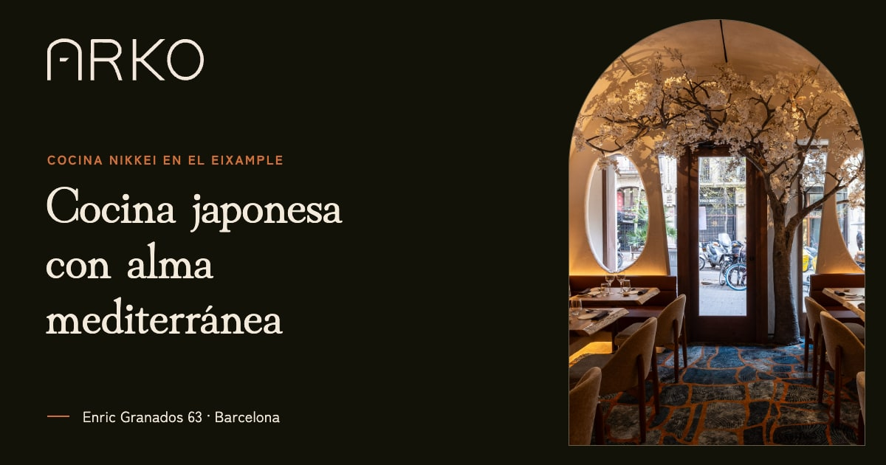

# Arko · Landing con scroll world

<a href="https://arko-sushi.midudev.workers.dev">
  <picture>
    <source srcset="https://raw.githubusercontent.com/midudev/mcp-higgsfield-landing/main/docs/scroll-desktop.avif" type="image/avif">
    
  </picture>
</a>

Landing de [Arko](https://www.arkorestaurant.com), restaurante de cocina nikkei en Carrer Enric Granados 63, en el Eixample de Barcelona. Está publicada en **[arko-sushi.midudev.workers.dev](https://arko-sushi.midudev.workers.dev)**.

La portada es un **paseo por el local que avanza y retrocede con el scroll**. Son seis clips generados con IA (MiniMax H3 a través de Higgsfield) a partir de siete fotos reales del restaurante, y cada uno une una foto con la siguiente. La web se montó con Claude Code, y todos los prompts que se usaron están en [`PROMPTS.md`](PROMPTS.md).

**Stack:** [Astro 7](https://astro.build) · [Tailwind CSS 4](https://tailwindcss.com) · [GSAP ScrollTrigger](https://gsap.com/docs/v3/Plugins/ScrollTrigger/) · [Lenis](https://lenis.darkroom.engineering) · sharp · Cloudflare Workers

## Puesta en marcha

Necesitas Node.js 22.12 o superior y pnpm.

```sh
pnpm install
pnpm dev
```

La web queda en `http://localhost:4321`.

| Comando | Qué hace |
| :-- | :-- |
| `pnpm dev` | Servidor de desarrollo con las marcas de contenido pendiente visibles |
| `pnpm astro dev --background` | El mismo servidor en segundo plano. Se gestiona con `pnpm astro dev status`, `logs` y `stop` |
| `pnpm build` | Genera la web estática en `dist/` |
| `pnpm preview` | Sirve el build en local para revisarlo antes de publicar |

## Cómo funciona el paseo

```text
7 fotos reales ──► keyframes 16:9 ──► 6 clips (MiniMax H3) ──► ffmpeg ──► public/video/ ──► src/scripts/world.ts
 public/photos      recorte/outpaint   1.er y último frame       GOP 6        paseo-1…6.mp4     scrub con el scroll
```

- **Seis paradas, seis tramos.** Cada parada de `paseo.paradas` (en `src/data/arko.ts`) tiene su clip, que va de ella a la siguiente. El clip de la última llega hasta el final de la sección. El texto de cada parada se queda fijo abajo a la izquierda mientras la cámara avanza.
- **El scroll manda.** `world.ts` traduce la posición del scroll a un valor continuo (0 en la primera parada, 1 en la segunda, 2,5 a medio camino entre la tercera y la cuarta…) y fija el `currentTime` del clip activo. No hay reproducción: el vídeo solo avanza cuando haces scroll.
- **Los pósters tapan la carga.** Bajo los vídeos está el primer fotograma de cada clip, sacado del propio MP4. Mientras un clip no ha cargado se ve su póster, y cuando entra el vídeo el cambio no se nota.
- **Carga por cercanía.** Los clips se descargan de uno en uno: primero el del tramo actual y después el más cercano a la posición del scroll. Cada uno se baja entero como blob para que el scrub no dependa de la red.
- **Móvil.** El 16:9 se recorta en vertical y el campo `focus` de cada parada decide qué parte horizontal queda a la vista.
- **Sin vídeo cuando no toca.** Con `prefers-reduced-motion` o con ahorro de datos activo solo se ven los pósters.
- **iOS.** Safari no pinta los fotogramas buscados hasta que el vídeo se ha reproducido una vez, así que cada clip hace un `play()` y un `pause()` al cargar.

Lenis suaviza el scroll y está sincronizado con ScrollTrigger. Debajo del paseo, la página sigue con los platos destacados, la prensa, las experiencias, las preguntas frecuentes, la tarjeta regalo y la llamada final.

## Cómo se hizo

El proceso completo, prompt a prompt, está en [`PROMPTS.md`](PROMPTS.md). En resumen:

1. **Primera versión** con la skill [`landing-page-design`](.claude/skills/landing-page-design/SKILL.md), usando solo datos verificados en arkorestaurant.com.
2. **Comparativa de modelos** con la misma transición (`3-mesas → 4-barra`) en Kling 3.0, MiniMax H3 y Seedance 2.0. Unos 64 créditos.
3. **Seis clips con MiniMax H3**, con la foto N como primer frame y la N+1 como último. Las fotos verticales se ampliaron a 16:9 con FLUX.2 Pro Outpaint. Clips de 8 s en 2K, bajados a 1080p. Coste: unos 137 créditos, unos 5 $.
4. **Montaje del scroll world** sobre el diseño, con un clip por tramo y carga priorizada.

## Estructura

```text
src/
├── data/
│   ├── arko.ts           Todo el contenido: paradas, precios, platos, FAQ, contacto, enlaces y SEO
│   ├── schema.ts         JSON-LD de la portada: Restaurant, WebSite, WebPage y FAQPage
│   └── imagenes.ts       Imagen para redes y fotos con URL fija (JSON-LD y sitemap)
├── pages/
│   ├── index.astro       Landing (con el JSON-LD)
│   ├── robots.txt.ts     robots.txt con la URL del sitemap
│   ├── llms.txt.ts       Resumen en texto plano para asistentes de IA
│   └── 404.astro
├── layouts/Layout.astro  <head>: metas, Open Graph, Twitter Card y fuentes
├── components/
│   ├── ScrollWorld.astro Escenario del paseo: pósters, clips, raíl de paradas y velos
│   ├── Stop.astro        Una parada del paseo
│   ├── Pending.astro     Marca de contenido pendiente (solo en desarrollo)
│   └── …                 Secciones de la página, logo, iconos y espirales
├── scripts/
│   ├── motion.ts         Lenis, apariciones al hacer scroll y animaciones con GSAP
│   └── world.ts          Lógica del paseo: scrub, pósters y cola de carga
├── styles/global.css     Tokens de Tailwind (colores, fuentes, curva) y utilidades
└── assets/               Fotos, pósters del paseo, fuentes recortadas y logo
public/
├── video/paseo-1…6.mp4   Clips del paseo, ya codificados para scrub
├── photos/               Fotos del local en JPG, enlazadas desde el JSON-LD y el sitemap
├── og-image.jpg          Imagen para redes (1200×630)
├── site.webmanifest      Manifest con los iconos icon-192.png e icon-512.png
└── _headers              Caché de un año para los archivos con hash de /_astro/
```

La carpeta `media/` es el material de trabajo: pruebas de modelos, keyframes, masters en 2K y los prompts de cada clip. Git ignora los vídeos y las imágenes porque pesan mucho.

## Editar el contenido

Los textos de la página viven en `src/data/arko.ts`, salvo el copy de las paradas, que está en `ScrollWorld.astro`. Arko es un negocio real, así que la regla es **no inventar nada**: ni reseñas, ni premios, ni platos, ni precios. Lo que no se ha podido verificar se marca con `<Pending>` o con el campo `pending`, y solo se ve con `pnpm dev`. Nunca llega al build.

## Cambiar un clip del paseo

Para que el scrub sea fluido, cada clip necesita un keyframe cada pocos fotogramas (`-g 6`). Además, el color va marcado como BT.709 con curva sRGB: sin esa marca, el navegador pinta el vídeo más claro que el póster y el salto se nota.

```sh
ffmpeg -i clip.mp4 -an -vf "scale=1920:-2" -c:v libx264 -preset slow -crf 28 \
  -g 6 -keyint_min 6 -sc_threshold 0 -pix_fmt yuv420p \
  -color_primaries bt709 -color_trc iec61966-2-1 -colorspace bt709 -color_range tv \
  -movflags +faststart+write_colr public/video/paseo-1.mp4
```

Después regenera su póster a partir del primer fotograma, conviértelo a WebP y guárdalo en `src/assets/paseo/`:

```sh
ffmpeg -i public/video/paseo-1.mp4 -frames:v 1 \
  -vf "scale=in_color_matrix=bt709:in_range=tv:out_range=pc,format=rgb24" paseo-1.png
```

## SEO

- **Dominio:** `site` en `astro.config.mjs` es la URL pública. De ella salen el canonical, `og:url`, `og:image`, el JSON-LD, el sitemap y `robots.txt`, así que basta con cambiarla ahí.
- **Metas:** título y descripción por página (los de la portada están en `seo`, en `src/data/arko.ts`), `robots` con `max-image-preview:large`, canonical con `hreflang` `es-ES` y `x-default`, y Open Graph y Twitter Card completos con la imagen `og-image.jpg`. No hay `twitter:site` porque Arko no tiene cuenta de X enlazada en su web. La 404 lleva `noindex`.
- **Datos estructurados:** un solo grafo en `src/data/schema.ts` con `Restaurant` (dirección, coordenadas, horario, rango de precio, carta con los platos y las experiencias con su precio, y reserva), `WebSite`, `WebPage` y `FAQPage` con las preguntas frecuentes. Todo sale de `src/data/arko.ts`.
- **Rastreo:** `@astrojs/sitemap` genera `sitemap-index.xml` sin la 404, con la imagen para redes y las fotos del local en la entrada de la portada. `robots.txt` lo enlaza. `llms.txt` resume el restaurante en texto plano.
- **Peso:** el HTML de la portada pesa unos 105 KB (unos 27 KB comprimido). Las espirales y el logo van en línea, con los paths compactados.

## Despliegue

Es una web estática que se sirve con Cloudflare Workers sin código de Worker. La configuración está en `wrangler.jsonc`.

```sh
pnpm build
pnpm dlx wrangler deploy
```

## Pendiente

- Dominio final. Ahora `site` apunta a `arko-sushi.midudev.workers.dev`.
- Fotos de los platos destacados. Cada plato ya tiene su hueco ovalado.
- Validar con el restaurante el texto sobre alergias.
- Política de cancelación y si las experiencias se piden al reservar o en la mesa.
- Nota y número de reseñas de Google, verificados.

## Créditos

- Fotos, logo y textos: © Arko Restaurant.
- Fuentes: [Hina Mincho](https://fonts.google.com/specimen/Hina+Mincho) y [Zen Kaku Gothic New](https://fonts.google.com/specimen/Zen+Kaku+Gothic+New), bajo licencia SIL OFL (las licencias están junto a los archivos). Se sirven desde el propio dominio y están recortadas a latín.
- Skills: [landing-page-design](https://github.com/elayadesign/ai-design-skills) y [scroll-world](https://github.com/oso95/scroll-world).
- Vídeo: [Higgsfield](https://higgsfield.ai) con MiniMax H3 y FLUX.2 Pro Outpaint.
